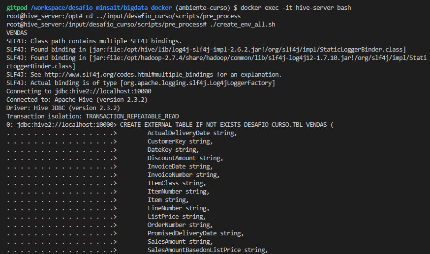
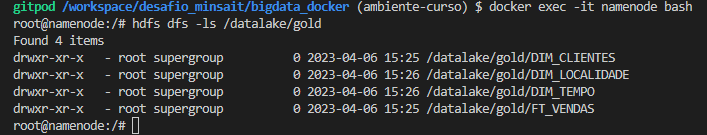

# DOCUMENTAÇÃO DO DESAFIO FINAL

## Remoção de espaços nos nomes das colunas dos arquivos CSV.
Para evitar problemas de compatibilidade com o HIVE e o PySpark, foram removidos os espaços e caracteres especiais dos nomes das colunas dos arquivos CSV presentes na pasta “raw”, esse procedimento foi feito através do terminal utilizando comandos Linux, prioritariamente o “vi”.

## Criação dos arquivos HQL.
Criação dos arquivos HQL que serão utilizados pelo Shell-script “create-env-all.sh”, que se encontra no caminho “input/desafio_curso/scripts/pre_process”, os HQLs criados encontram-se na pasta “hql” dentro de “scripts”.

  
## Alteração do Shell-script “create-env-all.sh”.
Após a criação dos arquivos HQL foi preciso alterar a estrutura do Shell-script “create-env-all.sh”, inserindo na variável o endereçamento de arquivos condizentes com os HQLs criados, evitando erros na execução do script.

 
## Criação do Shell-script para gerar estrutura Datalake no HDFS.
Dentro da pasta “scripts” foi criada uma nova pasta chamada “HDFS” para armazenar o Shell-script “create-hdfs-folders.sh” que será o primeiro a ser executado, este Shell-script foi criado para formar a estrutura de Datalake que contém as camadas Raw, Silver e Gold. A mesma é muito utilizada por grandes corporações, como Amazon, Netflix, Uber e etc. com o intuito de armazenar os arquivos por etapas de amadurecimento ou conclusão.

  
## Executando o Shell-script “create-hdfs-folders”.
Esta etapa é a criação do Datalake através da execução do shell-script, montando a estrutura de armazenamento de arquivos presentes localmente na pasta “input/desafio_curso/raw” para dentro do HDFS no diretório “datalake/raw” dentro de pastas que contém o mesmo nome dos arquivos.

## Criação do Banco de dados DESAFIO_CURSO.
Através do container do HIVE, e acessando com a string de conexão no terminal foi possível criar a tabela “DESAFIO_CURSO” utilizando os comandos de acesso ao “create database DESAFIO_CURSO” e para utilizar o banco na criação de tabelas o comando “use DESAFIO_CURSO”.

## Execução do Shell-script “create_env_all.sh”
Execução do shell-script “create_env_all.sh”, o mesmo cria o datalake com os arquivos .csv presentes localmente, além de executar os arquivos HQL, gerando assim de forma automatizada as tabelas do banco de dados.

## Salvar Dataframe “stage” na pasta “silver” do Datalake
Após processar e tratar os dados no pyspark, criando assim um único dataframe chamado “stage” que junta todas as informações das tabelas anteriores, foi executada uma função no pyspark para salvar os “stage” dentro do HDFS no diretório “/datalake/silver” e no repositório local dentro da pasta “Input/desafio_curso/silver/”.

   
## Salvar Fato e Dimensões na pasta “gold” local e do Datalake
Após utilizar o pyspark para transformar o Dataframe “stage” em um modelo dimensional que contém “Vendas” como fato e “Clientes”, “Localidade” e “Tempo” como dimensões, foi executada a função “salvar_df” para salvar a tabela fato e as tabelas dimensões dentro do Datalake “datalake/gold/” e no repositório local dentro da pasta “Input/desafio_curso/gold/”.

 
## Criação dos gráficos no Power Bi
Com os arquivos .csv salvos localmente, foi utilizado o arquivo do Power Bi “projeto vendas.pbix” presente na pasta “app” para a criação de relatórios gráficos com o intuito de facilitar a visualização dos dados presentes no banco.

 
## Testes
Testes de comparação da tabela “df_stage” do modelo relacional com o fato “ft_vendas” do modelo relacional, com o objetivo de verificar se houve perca de dados e informações durante o processo de criação do modelo dimensional. Para o teste, foram usadas as métricas de “quantidade de vendas” e “valor total de vendas”.
### Quantidade de vendas
Para essa métrica foi criado um comando PySpark para achar todas as ocorrências distintas da chave “OrderNumber”, achando assim o número total de vendas.

### Valor Total de Vendas
Para essa métrica foi utilizado a ferramenta Excel, na qual ao selecionar uma coluna, retorna várias informações sobre a coluna, sendo uma delas a soma total dos valores contidos na coluna.
   

